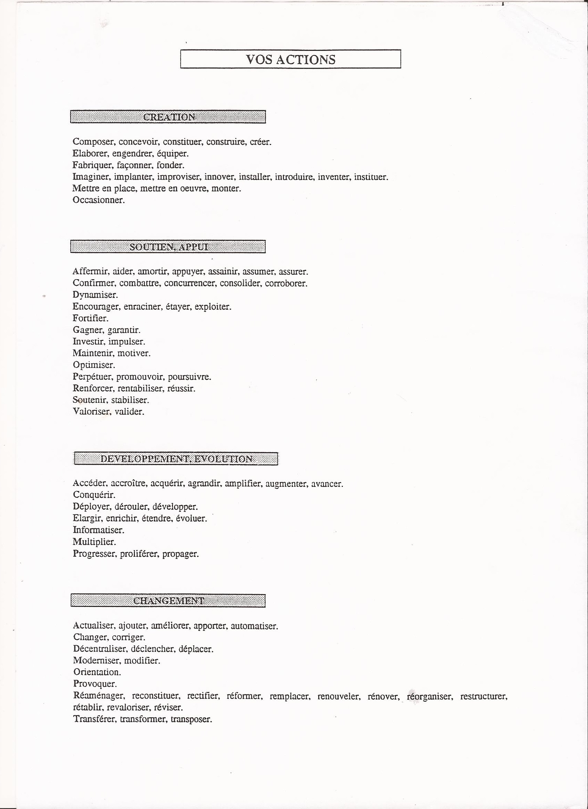
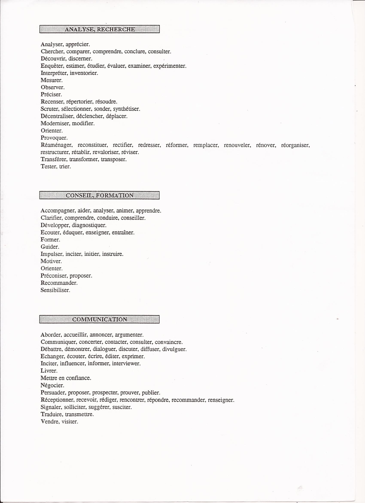
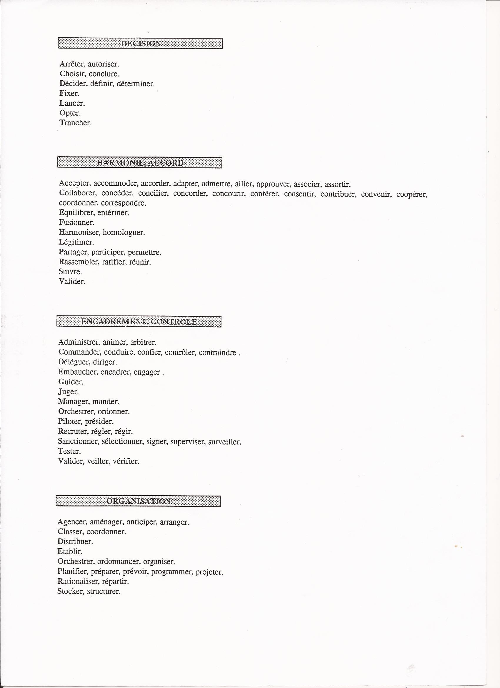
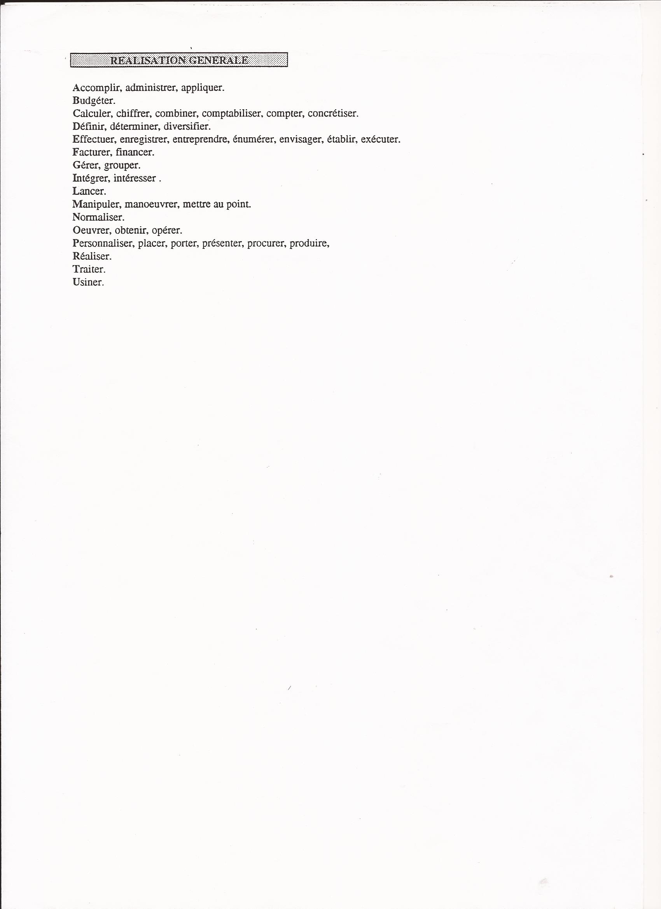

= Technique de recherche d'emploi

=== Verbes

==== verbe 1

==== verbe 2

==== verbe 3

==== verbe 4

=== La lettre de motivation

Objet : offre de compétence développeur +
 +
 +
Madame, Monsieur, +
Votre entreprise specialisé dans le domaine du developpement informatique, +
en particulier dans les applications mobile, attire mon attention et m'incite à vous proposer mes services. +
Pour vous permettre d'apprecier mon profil et ce que je suis en mesure de vous apporter, +
vous trouverez en piece jointe mon curriculum vitae. +
Mon experience professionnel, me permet de prendre en charge : +

* -----
* -----
* -----
* -----
